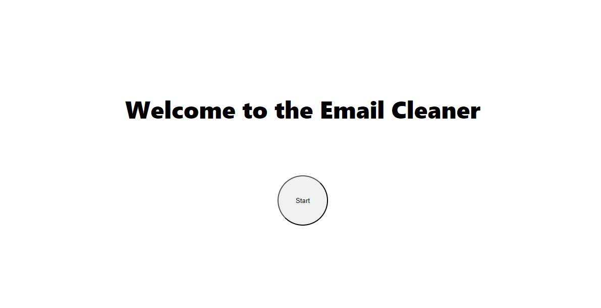
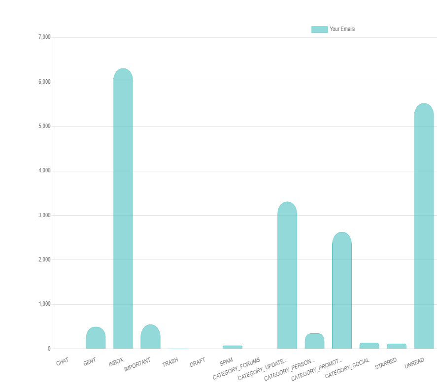

# Email-cleaner

### What does this project do?
At this moment, this hobby app generates a simple bar chart after the user signs in with their gmail account. 

Example: 

### Is it useful?
It's annoying to pay another app to clean my emails, so I'm learning to create one for my own sake  
So I suppose it is mainly useful for me at this point :P

### Task List so far
- [ ] Implement an ML algorithm
- [ ] Make UI look better
- [ ] Add options to manipulate emails like deletion, etc.